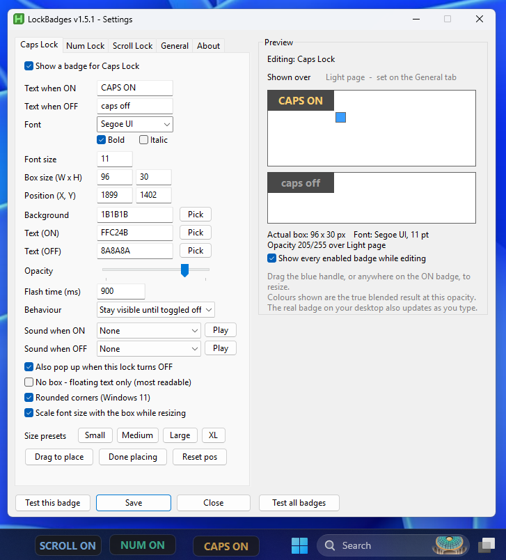
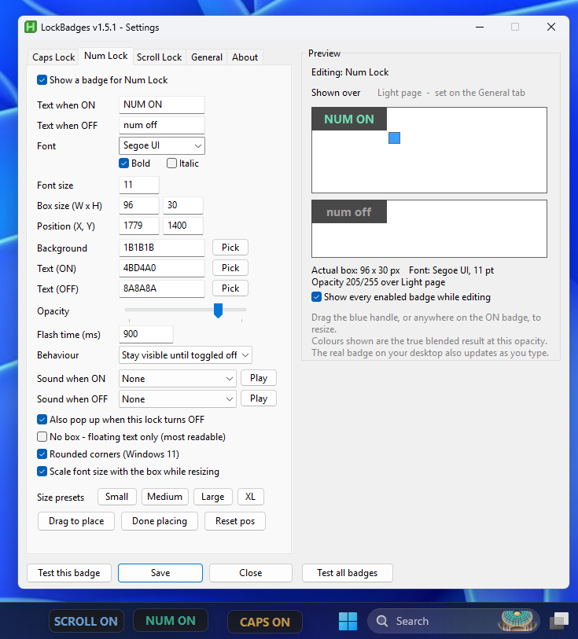
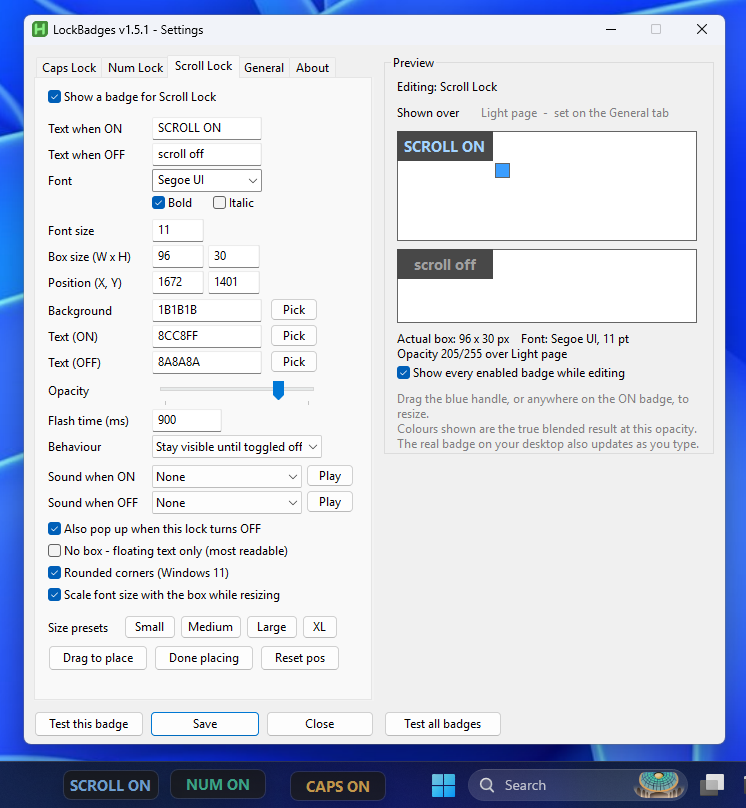
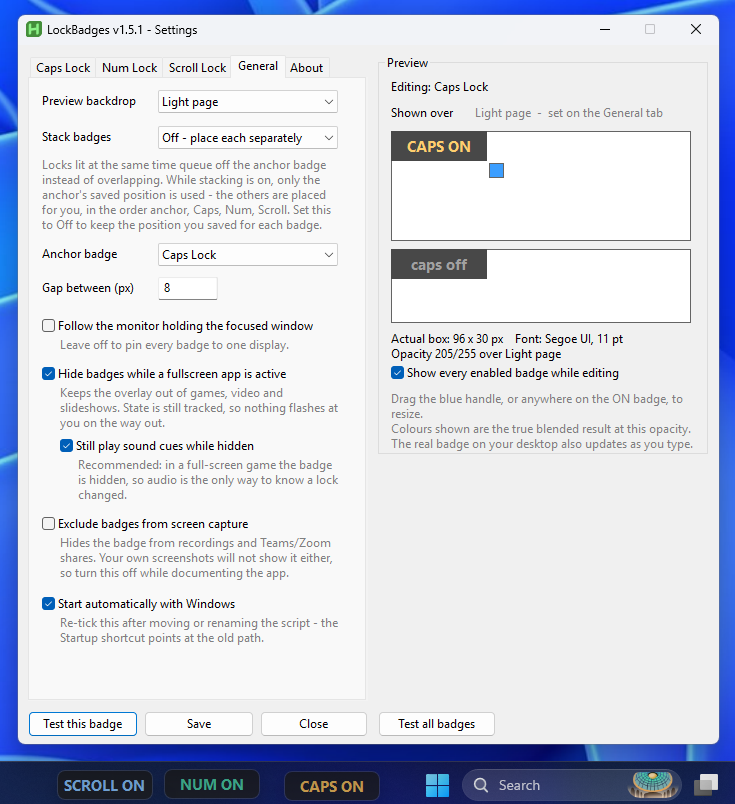
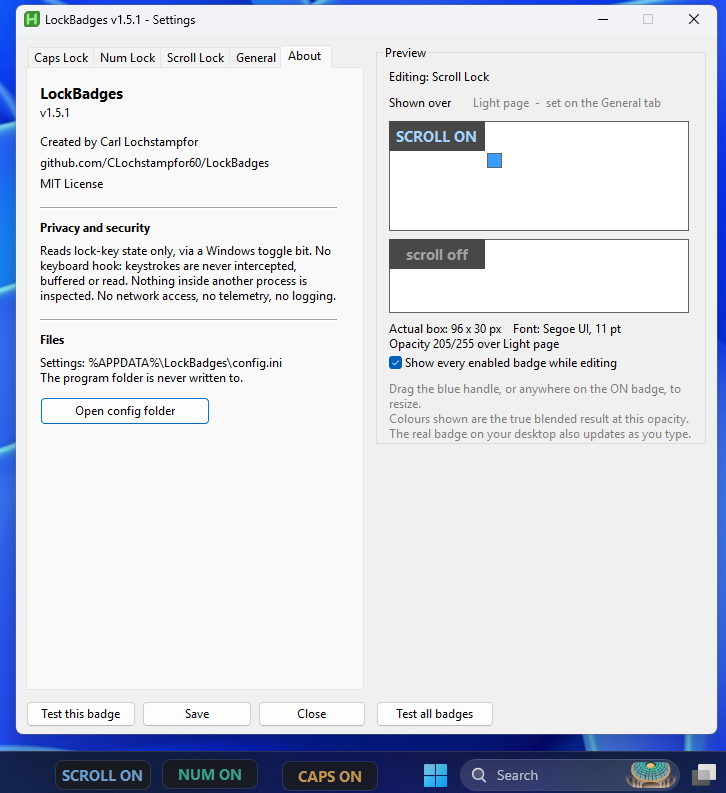
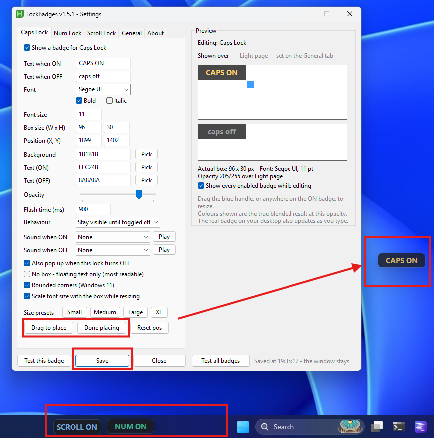
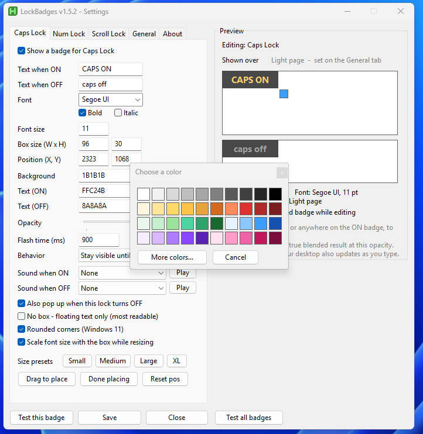
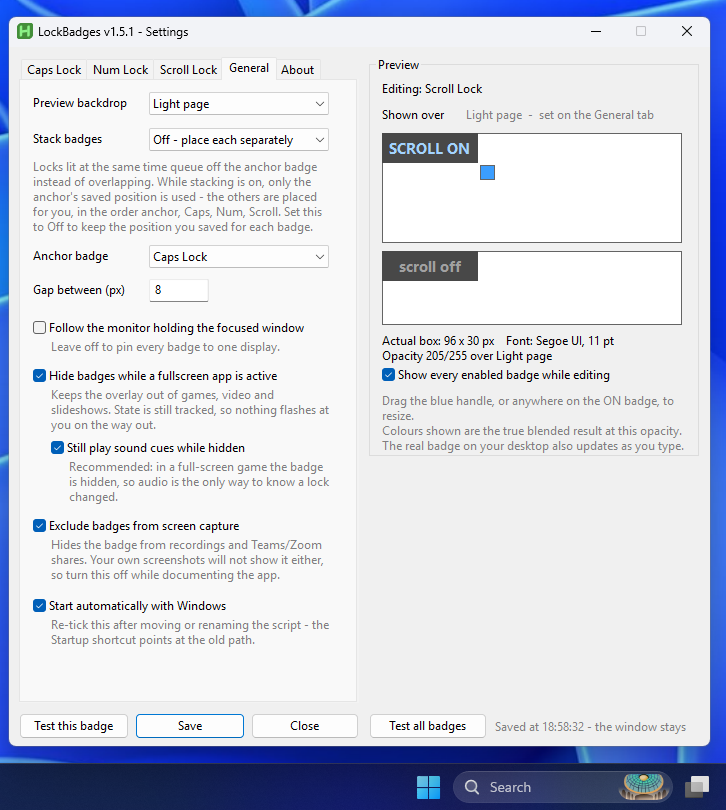
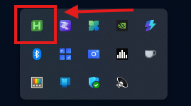

# LockBadges

**On-screen lock key indicators for keyboards that don't have them.** Caps Lock, Num Lock and Scroll Lock each get an independent, movable, translucent badge that you place wherever you actually look.




<sub>Three badges parked on an empty stretch of taskbar, left of the search box — visible in peripheral vision, out of the way of everything else. Placement like that is the reason this exists.</sub>

---

## Why this exists

My keyboard has no caps lock light. The existing utilities I tried each got something wrong:

- The popup was a large banner locked to the **top center** of the screen, directly over what I was typing.
- Others used a **tray icon**, which is useless when you already have fifteen tray icons and can't spot a small change among them.
- Logitech's Options+ notification looked good but was **fixed to the middle of the display** and **fully opaque**, so it covered content briefly every time it appeared.

The requirement was narrow and none of them met it: something visible in **peripheral vision**, positioned where *I* choose, **see-through** so it never hides what's underneath, and configurable without editing a file.

## Alternatives and prior art

I looked for existing tools before writing this. Credit where it's due:

| Project | License | Approach |
|---|---|---|
| [CapsLockIndicator](https://github.com/jonaskohl/CapsLockIndicator) | Apache-2.0 | The most mature option by a wide margin. Overlay on state change with configurable display time, opacity, font, border thickness, and separate activated/deactivated colors for background, text and border. Optional persistent overlay per lock. Position is chosen from a nine-cell grid. |
| [LogiLockLED](https://github.com/infra223/LogiLockLED) | Open source | Tray icons plus on-screen popups, and — its real differentiator — physical key backlight control through Logitech G Hub or OpenRGB. |
| [KeyzPal](https://github.com/limbo666/KeyzPal) | Open source | Tray icon indicators with four icon themes. No on-screen display. |

Closed-source freeware in the same category: TrayStatus, Keyboard LEDs, Keyboard Notifier, addLEDs, 7Caps.

**Why this one exists anyway.** The overlap with CapsLockIndicator is real — it also has opacity and a font picker, so "translucent overlay" alone isn't the gap. What LockBadges does differently:

- **Free pixel placement.** Nine grid cells cover corners, edges and center. They cannot put a badge in a specific empty spot on the taskbar, which is where I wanted mine. Drag it anywhere, or type exact coordinates.
- **Per-lock independence.** Each lock has its own colors, font, size, position, opacity, duration and behavior mode — not one shared appearance applied to all three.
- **No-box mode.** The background can be keyed out entirely, leaving only floating text, so nothing is ever hidden.
- **Environment awareness.** Auto-hide during fullscreen apps, follow the focused monitor, exclude from screen capture.
- **Composited preview.** Colors are previewed as the true blended result at your opacity over a chosen backdrop, because opacity that works over a white page often fails over a dark IDE.

**Where CapsLockIndicator is still ahead:** borders, localisation, years of bug fixes across many machines, and a packaged installer. If you want a solid indicator and don't care exactly where it sits, use it — it's good software. This project exists because I cared exactly where it sits.

## Features

**Placement and appearance**
- Drag the badge anywhere on screen, or type exact X/Y coordinates
- Drag-to-resize with a handle, or four one-click size presets
- Per-badge font (any installed font), size, bold/italic
- Color palette with 40 swatches plus the native Windows color picker, or raw hex
- Opacity slider, with an optional **"no box" mode** that removes the background entirely and floats only the text

**Behavior**
- **Flash briefly on change** or **stay visible until toggled off**, per lock
- Configurable flash duration and separate text/color for the ON and OFF states
- Optional sound cues per lock, separately for ON and OFF — a Windows system
  sound or your own WAV. Plays asynchronously and honors your sound scheme and
  mute state, so silencing Windows silences this too.
- Optional stacking (vertical or horizontal) from a configurable anchor badge, for when two locks are lit at once
- Click-through at all times — the badge can never intercept a click

**Environment awareness**
- Hides automatically while a fullscreen app is active (games, video, slideshows), while still tracking state so nothing flashes at you on the way out
- Sound cues keep playing while badges are hidden, so a lock change is still noticeable in a full-screen game
- Optional "follow the monitor holding the focused window" for multi-monitor setups
- Optional exclusion from screen capture, so it stays out of recordings and Teams/Zoom shares

**Live preview**
- The settings window previews colors as the **true alpha-composited result** at your chosen opacity, over a selectable backdrop (light page, dark editor, mid gray)
- Every enabled badge stays on your desktop while settings are open, so you can position one against the others

## Screenshots

<details open>
<summary><b>Caps Lock tab</b> — every lock gets its own full control set</summary>


Text, font, size, position, three colors, opacity, flash duration, behavior
mode and sound cues — all specific to this one lock. The preview panel on the
right shows the ON and OFF states as the true blended result at the chosen
opacity, over a selectable backdrop.

</details>

<details>
<summary><b>Num Lock tab</b> — same controls, independent values</summary>



Nothing is shared between locks. Num Lock here uses a green accent
(`4BD4A0`) and its own coordinates, so it sits beside Caps rather than on
top of it.

</details>

<details>
<summary><b>Scroll Lock tab</b> — disabled by default, enable if you want it</summary>



Scroll Lock ships disabled since few people use the key. Tick **Show a badge
for Scroll Lock** to bring it in.

</details>

<details>
<summary><b>General tab</b> — stacking, monitor behavior, capture, autostart</summary>



Stacking is off here, so each badge keeps the position you saved for it. Turn
it on and badges queue off the anchor instead, vertically or horizontally.

</details>

<details>
<summary><b>About tab</b> — version, license, and the privacy summary</summary>



</details>

<details>
<summary><b>Drag to place</b> — a badge can go anywhere, not into a preset slot</summary>



Click **Drag to place**, move the badge anywhere on screen with the mouse, then
**Done placing** to capture the coordinates and **Save** to keep them. Here the
Caps Lock badge has been pulled out to the right edge of the display while Num
and Scroll stay parked on the taskbar.

Two things are happening at once in that shot. The badge being placed is free to
land on any pixel — there is no grid of preset positions to choose from. And the
other enabled badges remain visible the whole time, click-through, so you can
line one up against its neighbors instead of guessing. Placement is a relative
judgment; you can't make it against invisible neighbors.

</details>

<details>
<summary><b>Color picker</b> — swatches for people, hex for precision</summary>



**Pick** next to any of the three color fields opens a 40-swatch grid. **More
colors...** hands off to the native Windows color dialog for anything not in the
grid. Clicking a swatch writes its hex value into the field, so you can also
find out what a color you liked is actually called — and type hex directly if
you already know it.

</details>

### Capture exclusion, demonstrated

Both screenshots were taken with all three badges lit on the taskbar. The only
difference that matters is the **Exclude badges from screen capture** checkbox —
off on the left, on on the right. In the right-hand image the badges are simply
not in the capture. The screenshot is the proof, not a description of it.

(The two shots aren't otherwise identical — the preview panel happens to be on a
different tab in each — but the taskbar strip at the bottom is the point.)

<table>
<tr>
<td width="50%"></td>
<td width="50%"></td>
</tr>
<tr>
<td align="center"><sub><b>Off</b> — badges captured normally</sub></td>
<td align="center"><sub><b>On</b> — badges absent from the capture</sub></td>
</tr>
</table>

This is why the option defaults to off: leave it on and your own documentation
screenshots won't show the app either.

## Requirements

- Windows 10 or 11
- [AutoHotkey v2.0+](https://www.autohotkey.com/) — **v2 specifically**; v1.1 will refuse to run this script

## Install

1. Install AutoHotkey v2 from [autohotkey.com](https://www.autohotkey.com/).
2. Download `LockBadges.ahk` from [Releases](../../releases) or clone this repo.
3. Put it somewhere permanent. **`C:\Program Files\LockBadges\` is recommended** — see [Security](#security-and-privacy) for why the location matters.
4. Double-click it. A green **H** appears in your tray — that's the AutoHotkey interpreter running the script.

   

5. Left-click the tray icon (or press <kbd>Ctrl</kbd>+<kbd>Alt</kbd>+<kbd>Shift</kbd>+<kbd>C</kbd>) to open Settings.
6. On the **General** tab, tick **Start automatically with Windows**, then **Save**.

> Autostart writes a shortcut to your Startup folder pointing at the script's **current** path. If you move or rename the file afterwards, untick and re-tick the box to repoint it.

## Settings reference

| Tab | What it controls |
|---|---|
| **Caps Lock** / **Num Lock** / **Scroll Lock** | Everything about that one badge: enable, ON/OFF text, font, size, position, colors, opacity, flash duration, behavior mode |
| **General** | Preview backdrop, stacking mode and anchor, gap, monitor follow, fullscreen hiding, screen-capture exclusion, autostart |
| **About** | Version, author, license, privacy summary, config folder shortcut |

**Buttons that aren't self-explanatory:**

- **Drag to place** — the badge becomes draggable on the desktop. Move it, then click **Done placing** to capture the position. ([screenshot](#screenshots))
- **Test this badge** / **Test all badges** — plays the real fade-in/fade-out so you can judge timing.
- **Save** leaves the window open so you can keep tuning. **Close** prompts if you have unsaved changes.

**Tips**

- For peripheral vision, a heavy font at a smaller size (Arial Black, Segoe UI Black) reads better than a large thin one.
- Opacity behaves very differently over a white document than over a dark IDE. Use the **Shown over** dropdown to check both before committing.
- If you place badges by hand, set stacking to **Off** — stacking deliberately ignores each badge's saved position in favor of the anchor.

## Configuration file

Settings live in `%APPDATA%\LockBadges\config.ini`, one section per lock plus `[General]`. It's plain text and safe to edit by hand. The **Open config folder** button on the About tab takes you there.

The program folder is never written to. That separation is intentional: it lets you install to a read-only location.

Autostart is the one setting *not* stored in the INI — it's derived from whether `LockBadges.lnk` exists in your Startup folder, so the checkbox always reflects reality rather than a stale saved value.

## Security and privacy

This app reads **lock key state**. It does not, and structurally cannot, observe what you type.

- **No keyboard hook.** State comes from `GetKeyState(key, "T")`, which asks Windows for a toggle bit. Keystrokes are never intercepted, buffered or read. There is no hook to leak or subvert.
- **No inspection of other processes.** No control handles, no control text, no window titles. The only foreign-window data used is the foreground window's class, style and rectangle, solely to detect fullscreen apps.
- **No network access, no telemetry, no update check, no logging.**

These constraints are written into the source header as an explicit invariant, because the risk isn't today's code — it's a future change that quietly relaxes one of them.

**A feature that was removed on purpose.** An earlier build detected password fields (via the focused control's `ES_PASSWORD` style) and held the caps badge visible while you typed in one. It was cut because:

1. Pressing caps in a password box already triggered the ordinary flash, so it only covered the case where caps was *already* on.
2. It could only see native Win32 controls. Browsers render their own password fields, so web logins — the common case — were never detected anyway.
3. Browsers and Windows already warn about caps lock in password fields.

It was the only code that reached into another process, and it bought very little. Removing it made the privacy claim absolute instead of qualified.

**Install location matters.** This script runs automatically at every login, so write access to the file means code execution as you, persistently. Install it somewhere your normal user token cannot write — `C:\Program Files\...` is ideal. Verify with:

```powershell
icacls "C:\Program Files\LockBadges"
```

You want no `(M)` or `(W)` for `Users` or `Authenticated Users`. Then confirm from a **non-elevated** prompt that a write actually fails:

```powershell
New-Item "C:\Program Files\LockBadges\writetest.txt"
```

Access denied is the pass. Checking the ACL tells you what Windows intends; attempting the write tells you what your everyday token can really do.

> **Gotcha worth knowing:** moving a folder within the same volume *preserves its original permissions*. A folder created at `C:\` root and then cut-and-pasted into Program Files arrives carrying the weaker ACL it was born with. It looks protected and isn't. Copy-then-delete inherits the destination's permissions instead; a move does not.

## Antivirus and SmartScreen

If you compile this to an `.exe` with Ahk2Exe, expect antivirus and SmartScreen warnings. This is normal for AutoHotkey binaries and worth understanding rather than working around:

- A compiled AHK executable bundles the interpreter alongside your script, which resembles the packing behavior heuristics associate with malware.
- Automation tooling that reads keyboard state is, structurally, similar to a keylogger. Heuristics can't tell intent apart from implementation.
- An unsigned binary with no download history has no SmartScreen reputation.

**This repository ships the `.ahk` source as the primary artifact for exactly that reason.** Run under the signed AutoHotkey interpreter and none of it applies. The source is short, commented, and readable end to end — verify it yourself rather than trusting a binary.

## Design notes

**Fn Lock is deliberately unsupported.** It's handled by the keyboard's embedded controller, which must work before any OS loads (Fn+F2 for setup, brightness during POST, F12 for the boot menu). It never reaches Windows, and no API reports it. Being invisible to the OS is the design requirement that forced firmware handling, not a side effect. It also changes what the F-row *does* rather than what you *type*, so a wrong guess self-corrects in a second. A badge that's wrong half the time is worse than no badge. If you want F-row predictability, set it once in your BIOS.

**Insert Lock is unsupported for a different reason.** Windows does track an Insert toggle bit, but it's effectively a parity counter of key presses, not a report of application state. Overtype mode is owned per-application — Word tracks its own, VS Code has its own, Notepad and browsers ignore Insert entirely, and nothing resynchronises when you switch windows. The badge would confidently contradict the app you're typing in.

**Click-through by default.** Badge windows carry `WS_EX_TRANSPARENT`, so mouse events pass through to whatever is underneath. An overlay that can steal a click is worse than no overlay. It's temporarily disabled only during "Drag to place".

**Polling, not hooking.** A 100ms timer reading a toggle bit is simpler, cheaper and safer than a keyboard hook, and it's the reason the privacy claim above holds.

**Preview honesty.** A child control can't be genuinely translucent, so the preview alpha-composites the badge colors against the selected backdrop using the same maths Windows applies to a layered window. The colors shown are the real result, not an approximation.

## Troubleshooting

**Windows asks which app to open the .ahk with** — AutoHotkey isn't installed. Install v2; it registers the file association.

**"This script requires AutoHotkey v2"** — you have v1.1. They install side by side; get v2.

**Badge doesn't appear after a reboot** — check `shell:startup` for `LockBadges.lnk`, and confirm it points at the file's current path. Re-tick autostart in Settings if you moved the script.

**Two badges of the same lock** — two copies of the script are running. Exit from the tray and check for stray copies elsewhere.

**Badge is off-screen** — the position is saved in the INI. Use **Reset pos** on that lock's tab, or edit `x`/`y` in `config.ini`.

**Reset pos moves it off my taskbar** — expected. It uses the monitor *work area*, which excludes the taskbar. Use Drag to place instead.

**Badge missing from my screenshots** — "Exclude badges from screen capture" is on. Turn it off while documenting. See [Capture exclusion, demonstrated](#capture-exclusion-demonstrated).

## Uninstall

1. Right-click the tray icon → **Exit**
2. Delete the `.ahk` file
3. Delete `%APPDATA%\LockBadges\`
4. Delete `LockBadges.lnk` from `shell:startup`

No registry keys, no services, no other files.

## Roadmap

- Config export/import
- Idle auto-normalize (turn caps off after N seconds untouched)

## Contributing

This is a personal portfolio project and I'm not accepting pull requests. Bug reports via Issues are welcome. Forking is encouraged — MIT means you can do what you like with it.

## License

MIT — see [LICENSE](LICENSE).

AutoHotkey itself is licensed under the GPL. This repository distributes only the `.ahk` source, which is my own work under MIT, and does not bundle any AutoHotkey binary. If you compile it and redistribute the resulting `.exe`, the compiled artifact contains the AutoHotkey interpreter and the licensing picture becomes genuinely contested — AutoHotkey's original author stated that compiled scripts may be sold commercially, while others argue GPL obligations attach to the interpreter portion. Do your own research before distributing binaries.

## Author

**Carl Lochstampfor** — [@CLochstampfor60](https://github.com/CLochstampfor60)
